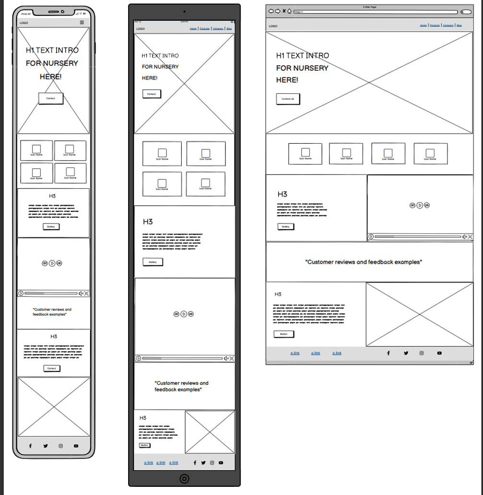
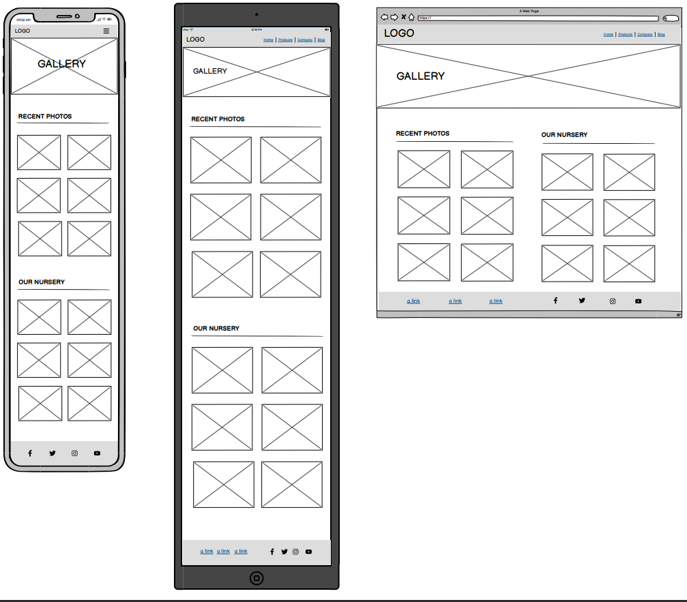
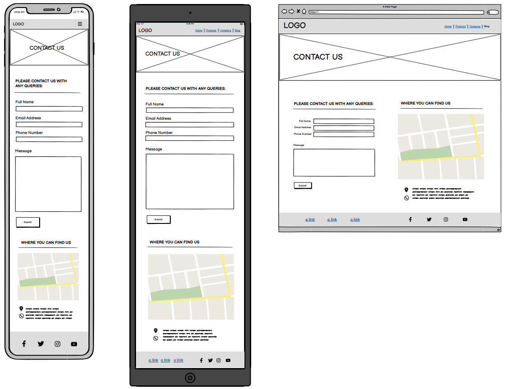

# LITTLE HATCHLINGS

<!-- overview of project -->
Finding a childcare nursery can be a daunting experience for parents as they have the worry of leaving their precious bundle of joy in the care of trusted staff. There are many nurseries around but how do you know which nursery is best for your little one? Many nurseries like Little Hatchlings do not have a website or have a Facebook website rather than investing in a website. 
After I conducted a survey on survey monkey (link in the sources) I can see most parents use online as their first way of searching for a nursery or contact information for a nursery and a website is the perfect way to give that first impression to your target audience, so how can we achieve that?

<!-- what the project hopes to accomplish, who it is intended to target, and how it will be useful to the target audience. -->
The Strategy - The nursery's target audience are parents and the goal is to create a website for Little Hatchlings so we can use the power of the website to persuade our audience that this is the nursery that they want to put their child/children in. Needs and wants of the target audience are reassurance that they are putting their child in a nursery where they are safe, comfortable with the staff and are properly taken care of in the absence of the parents(food, water, nappy, changes etc). Another need that the user wants to see is that their child will develop their social skills, confidence and learning skills to a high standard whilst at the nursery in preperation for mainstream schooling. 
To help achieve a successful website I have listened to the parents most common responses on the survey I conducted and used that information to decide on the hierarchy/order of the website such as to provide the reassurance by displaying awards they've had, reviews/customer feedback, ofsted rating, google ratings, day nurseries rating awards.

http://amiresponsive.co.uk/?site=http%3A%2F%2Fstaceyjaynelewis.github.io%2Flittle-hatchlings

Scope - I have noticed other nursery sites laying out their pages in what the nursery THINK is priority information the parents want to see instead of what the parents REALLY want to see, so designing the website based on the customers reponses/feedback is just one of the things we can offer that make our website stand out to other websites. 

When conducting research on external sources 'capture education website'(link in resources) recommends good quality images, meet the staff page, announcements/awards and map on the contact page of the location/s are the 4 important features for nursery websites. Nurseries say they just need a website with contact information and a gallery but as mentioned above what they actually need is a website to set the impression, boost reputation and do all the talking for the nursery. The below importance and feasibility chart is created based on the surveyMonkey responses, external resource research and what the nursery say they want which resulted in the outcome in the screenshot below.

When looking at the chart one of the important features is a meet the staff page which shows images of all the staff however it could be a future feature as there are more important features needed such as showing the facilities and gallery to increase customer interaction and reputation.

Structure - For the structure of the navigation bar I decided to stick with the usual conventions as that is what users expect, there is no need to make the website complex as it won't retain the users attention. Also, simply a factful approach can demonstrate the companies reputation and ratings easier. 

Skeleton Plane -  

Surface Plane - The website needs to be friendly as the website will be the first thing they see when looking for childcare for they children.

## UX
<!-- In this section, you will briefly explain your design processes. -->

### Colour Scheme

For color scheme I decided that as the target audience are the parents of the children that the 3 colors white, purple and yellow would be enough to look professional and playful but it also doesn't distract the users with too much colors.  My logo little hatchlings has a chick icon in the logo to represent the 'hatchlings' in the name and the stereotypical color for a chick in design is yellow but also yellow can symbolize the unisex and happy element of the nursery.

The purple has been used in the illustration hero image to symbolize the child 'out in space' and so I have also carried that color through the website to keep the theme consistent through the website. The purple has also been useful on text and informative design elements

I have used both colors throughout the website so that the page designs flow nicely into each other and can be clearly identified as one.
-yellow used to highlight the key areas.
	
- `#000000` used for primary text.
- `yellow` used for primary highlights.
- `yellow` used for secondary text.
- `##5A31AD` used for secondary highlights.

I used [coolors.co](https://coolors.co/ffffff-5a31ad-ffff00-8f73c7-000000) to generate my colour palette.

### Typography

	
Explain any fonts and icon libraries used, like Google Fonts and/or Font Awesome.
	
Consider adding a link to each font used, and the Font Awesome site if used (or similar icon library).

Example:

- [Montserrat](https://fonts.google.com/specimen/Montserrat) was used for the primary headers and titles.
	
- [Lato](https://fonts.google.com/specimen/Lato) was used for all other secondary text.
	
- [Font Awesome](https://fontawesome.com) icons were used throughout the site, such as the social media icons in the footer.

## User Stories

<!-- ### New Site Users
	
- As a new site user, I would like to ____________, so that I can ____________.
- As a new site user, I would like to ____________, so that I can ____________.
- As a new site user, I would like to ____________, so that I can ____________.
- As a new site user, I would like to ____________, so that I can ____________.
- As a new site user, I would like to ____________, so that I can ____________.
	
### Returning Site Users
	
- As a returning site user, I would like to ____________, so that I can ____________.
- As a returning site user, I would like to ____________, so that I can ____________.
- As a returning site user, I would like to ____________, so that I can ____________.
- As a returning site user, I would like to ____________, so that I can ____________.
- As a returning site user, I would like to ____________, so that I can ____________.
	
### Site Admin
	
- As a site administrator, I should be able to ____________, so that I can ____________.
- As a site administrator, I should be able to ____________, so that I can ____________.
- As a site administrator, I should be able to ____________, so that I can ____________.
- As a site administrator, I should be able to ____________, so that I can ____________.
- As a site administrator, I should be able to ____________, so that I can ____________. -->

## Wireframes
	
Wireframes were developed for mobile, tablet, and desktop sizes so I have used [Balsamiq](https://balsamiq.com/wireframes) to design my site wireframes as seen below.

### Home Page Wireframes
	
| Size | Screenshot |
| --- | --- |
| From left to right: Mobile Tablet Desktop |  |
	
### Gallery Page Wireframes
	
| Size | Screenshot |
| --- | --- |
| From left to right: Mobile Tablet Desktop |  |
	
### Contact Page Wireframes

| Size | Screenshot |
| --- | --- |
| From left to right: Mobile Tablet Desktop |  |	

## Features

### Existing Features
	
- **Gallery & facilities page**
	
- I decided that creating a whole facilities page may not be feasible in the timescale that I have and so I incorperated the facilities in the gallery page by seperating the gallery into two sections. The reason behind this is because parents want to see the enviroment that their child will be in whilst at the nursery and the images of the rooms, outdoor area etc sets an idea of what it is like and may entice them to book a viewing at the nursery.

- You can see below in the screenshot a layout of the gallery in desktop version and in smaller devices. I have made the heading links for the smaller devices so when clicked it will jump scroll to the second section quickly so it is user friendly.
	

- I have also used the bootstrap lightbox feature to allow the images to be viewed in large scale as the images are in 2 columns rather than 1. I made the decision to use 2 columns on small devices to make it user friendly so if more images are added in future it is not exhaustive for the user as they can see more selection on their screen rather than scrolling each individual photo. An example of the lightbox feature is below:

	
- **Title for feature #2**
	
- Details about this particular feature, including the value to the site, and benefit for the user. Be as detailed as possible!
	

	
- **Title for feature #3**
	
- Details about this particular feature, including the value to the site, and benefit for the user. Be as detailed as possible!
	

<!-- Repeat as necessary for as many features as your site contains. e.g Brand name and logo, Contact and social media information Calls to action prompts and buttons, about us page, search functionality-->

### Future Features

- Check-in booking system
	- An idea could be a check in system for the children on the website or a dashboard where you can see updates throughout the day such as nappy changes, food menu, any medications taken etc to encourage customers to come back and interact with the website more. 
- Staff page displaying all the staff members
    - A page that has all the qualified staff members is important to have so the parents can see who will be looking after their children and putting faces to names can help parents build the relationship and trust with the staff. It can also reassure them to see the qualifications and experience that the staff members have.
- About Us Page
	 - I would like to add an about page where I can go more in depth on the backrgound/history of the Nursery because I noticed that every response I had from my survey I conducted said they do like to read about the background of the nursery.
- Update/News section
    - Having a section with updates or recent changes on the nursery would be useful however it is not essential as reflecting on my surveyMonkey responses most customers would refer to our social media page for news/updates. 

## Tools & Technologies Used
	
- [HTML](https://en.wikipedia.org/wiki/HTML) used for the main site content.
- [CSS](https://en.wikipedia.org/wiki/CSS) used for the main site design and layout.
- [CSS Flexbox](https://www.w3schools.com/css/css3_flexbox.asp) used for an enhanced responsive layout.
- [CSS Grid](https://www.w3schools.com/css/css_grid.asp) used for an enhanced responsive layout.
- [JavaScript](https://www.javascript.com) used for user interaction on the site.
- [Python](https://www.python.org) used as the back-end programming language.
- [Git](https://git-scm.com) used for version control. (`git add`, `git commit`, `git push`)
- [GitHub](https://github.com) used for secure online code storage.
- [GitHub Pages](https://pages.github.com) used for hosting the deployed front-end site.
- [CodeAnywhere](https://app.codeanywhere.com) used as a cloud-based IDE for development.
- [Bootstrap](https://getbootstrap.com) used as the front-end CSS framework for modern responsiveness and pre-built components.
- [Free Convert](https://www.freeconvert.com/video-compressor/download) used to condense the video on the index.html about section to 1MB
- [Vimeo](https://vimeo.com/830718795?share=copy) used to help put the video clips together and make the full video and effects.
- [Balsamiq](https://balsamiq.com/wireframes) used to create the wireframes for the website ideas/mock ups.

## Testing
	
For all testing, please refer to the [TESTING.md](TESTING.md) file.
	
## Deployment
	
The site was deployed to GitHub Pages. The steps to deploy are as follows:
- In the [GitHub repository](https://github.com/staceyJayneLewis/little-hatchlings), navigate to the Settings tab 
- From the source section drop-down menu, select the **Main** Branch, then click "Save".
- The page will be automatically refreshed with a detailed ribbon display to indicate the successful deployment.
	
The live link can be found [here](https://staceyjaynelewis.github.io/little-hatchlings)
	
### Local Deployment
	
This project can be cloned or forked in order to make a local copy on your own system.
	
#### Cloning
	
You can clone the repository by following these steps:
	
	1. Go to the [GitHub repository](https://github.com/staceyJayneLewis/little-hatchlings) 
	2. Locate the Code button above the list of files and click it 
	3. Select if you prefer to clone using HTTPS, SSH, or GitHub CLI and click the copy button to copy the URL to your clipboard
	4. Open Git Bash or Terminal
	5. Change the current working directory to the one where you want the cloned directory
	6. In your IDE Terminal, type the following command to clone my repository:
		- `git clone https://github.com/staceyJayneLewis/little-hatchlings.git`
	7. Press Enter to create your local clone.
	
Alternatively, if using Gitpod, you can click below to create your own workspace using this repository.
	

	
Please note that in order to directly open the project in Gitpod, you need to have the browser extension installed.
A tutorial on how to do that can be found [here](https://www.gitpod.io/docs/configure/user-settings/browser-extension).
	
#### Forking
	
By forking the GitHub Repository, we make a copy of the original repository on our GitHub account to view and/or make changes without affecting the original owner's repository.
You can fork this repository by using the following steps:
	
	1. Log in to GitHub and locate the [GitHub Repository](https://github.com/staceyJayneLewis/little-hatchlings)
	2. At the top of the Repository (not top of page) just above the "Settings" Button on the menu, locate the "Fork" Button.
	3. Once clicked, you should now have a copy of the original repository in your own GitHub account!
	
### Local VS Deployment

<!-- Use this space to discuss any differences between the local version you've developed, and the live deployment site on GitHub Pages. -->

## Credits
	
<!-- In this section you need to reference where you got your content, media, and extra help from.
It is common practice to use code from other repositories and tutorials,
however, it is important to be very specific about these sources to avoid plagiarism. -->

### Content
	
<!-- Use this space to provide attribution links to any borrowed code snippets, elements, or resources.
A few examples have been provided below to give you some ideas.
	
Ideally, you should provide an actual link to every resource used, not just a generic link to the main site! -->
	
| Source | Location | Notes |
| --- | --- | --- |
| [Markdown Builder](https://traveltimn.github.io/markdown-builder) | README and TESTING | tool to help generate the Markdown files |
| [Bootstrap Lightbox](https://lokeshdhakar.com/projects/lightbox2/) | Gallery Page | Tool to make gallery images larger when clicked
| [Stackoverflow](https://stackoverflow.com/questions/46249541/change-arrow-colors-in-bootstraps-carousel) | Home Page | Help to change arrow colour on carousel in the reviews section of the index.html
| [Stackoverflow](https://stackoverflow.com/questions/46249541/change-arrow-colors-in-bootstraps-carousel) | Home Page | Help to change arrow colour on carousel in the reviews section of the index.html
|  | Home Page | Help to change arrow colour on carousel in the reviews section of the index.html

	https://stackoverflow.com/questions/69960612/putting-an-image-below-the-nav-bar-bootstrap-and-css-without-it-being-overlapped
	https://getbootstrap.com/docs/4.0/components/navbar/#:~:text=%3E-,Color%20schemes,customize%20with%20.bg%2D*%20utilities
	https://stackoverflow.com/questions/46249541/change-arrow-colors-in-bootstraps-carousel
	https://www.w3docs.com/snippets/css/how-to-auto-resize-an-image-to-fit-an-html-container.html
	https://stackoverflow.com/questions/12415661/using-marginauto-to-vertically-align-a-div
	https://www.freeconvert.com/video-compressor/download - to condense video
https://capture-education.co.uk/blog/2018/04/25/5-ways-a-nursery-website-can-benefit-you/ 

### Media
	
<!-- 	
	Use this space to provide attribution links to any images, videos, or audio files borrowed from online.
	A few examples have been provided below to give you some ideas.
	
	If you're the owner (or a close acquaintance) of all media files, then make sure to specify this.
	Let the assessors know that you have explicit rights to use the media files within your project.
	
	Ideally, you should provide an actual link to every media file used, not just a generic link to the main site!
	The list below is by no means exhaustive. Within the Code Institute Slack community, you can find more "free media" links
by sending yourself the following command: `!freemedia`. -->

	| Source | Location | Type | Notes |
	| --- | --- | --- | --- |
	| [Pexels](https://www.pexels.com) | entire site | image | favicon on all pages |
	| [Lorem Picsum](https://picsum.photos) | home page | image | hero image background |
	| [Unsplash](https://unsplash.com) | product page | image | sample of fake products |
	| [Pixabay](https://pixabay.com) | gallery page | image | group of photos for gallery |
	| [Wallhere](https://wallhere.com) | footer | image | background wallpaper image in the footer |
	| [This Person Does Not Exist](https://thispersondoesnotexist.com) | testimonials | image | headshots of fake testimonial images |
	| [Audio Micro](https://www.audiomicro.com/free-sound-effects) | game page | audio | free audio files to generate the game sounds |
	| [Videvo](https://www.videvo.net/) | home page | video | background video on the hero section |
	| [TinyPNG](https://tinypng.com) | entire site | image | tool for image compression |
	
	### Acknowledgements
<!-- 
    	Use this space to provide attribution to any supports that helped, encouraged, or supported you throughout the development stages of this project.
A few examples have been provided below to give you some ideas. 
	- I would like to thank my Code Institute mentor, [Tim Nelson](https://github.com/TravelTimN) for their support throughout the development of this project.
	- I would like to thank the [Code Institute](https://codeinstitute.net) tutor team for their assistance with troubleshooting and debugging some project issues.
	- I would like to thank the [Code Institute Slack community](https://code-institute-room.slack.com) for the moral support; it kept me going during periods of self doubt and imposter syndrome.
	- I would like to thank my partner (John/Jane), for believing in me, and allowing me to make this transition into software development.
- I would like to thank my employer, for supporting me in my career development change towards becoming a software developer.

-->

<!-- future -->
If I had the time and resources what I would like to do after seeing the responses of my survey is to create a 'book a viewing' system for my website but also a system that allows you to sign your child into the nursery and sign them out.
 for example offering a booking system so you can book a viewing, displaying other parent reviews and showing any awards they have achieved. 
 showing the staff page
