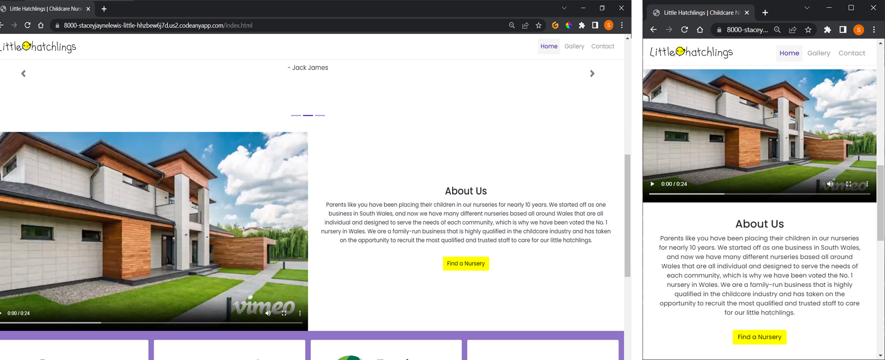
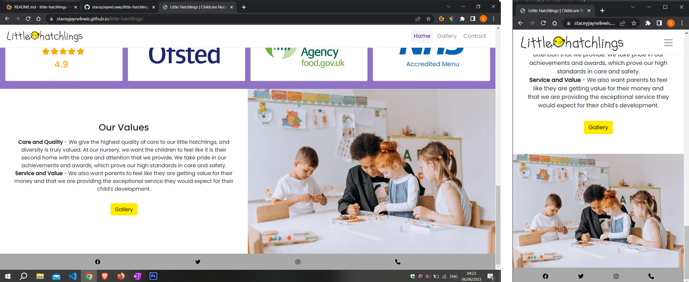

# LITTLE HATCHLINGS

<!-- overview of project -->
Little Hatchlings is a childcare nursery that is looking to stand out against other competitors and as they have developed more centers around Wales, the business owners are looking to invest in a website that will give the best representation of the nursery and what they can expect. The nursery's aim is to encourage parents to come and view the nursery to hopefully increase the nursery applications and grow the business. Many nurseries like Little Hatchlings do not have a website at all or depend on social media pages such as Facebook and Twitter to hold any contact information and updates of the nursery. After I conducted my own research online and creating my own survey on surveyMonkey (https://www.surveymonkey.co.uk/r/WXV275K), it is apparent that, since we are becoming a more digital dominated world, that most parents use online/mobile as their first method of searching for a nursery. Using my online research but also speaking to the nursery owner directly, it is also clear that the nursery's target audience is around 18 - 40 and in this age range, the audience is likely to be tech-savvy and so, a website is the perfect way to give that first impression to the target audience. The website is responsive and so it can be accessed on most devices, such as mobiles, tablets and laptops/computers, making it user friendly.

http://amiresponsive.co.uk/?site=http%3A%2F%2Fstaceyjaynelewis.github.io%2Flittle-hatchlings

## UX

The Strategy - We can use the power of the website to persuade our audience that this is the nursery that they want to put their child/children in and having a website makes it easy to share and advertise on social media, business cards and by word of mouth. The needs and wants of the target audience are reassurance that they are putting their child in a nursery where they are safe, comfortable with the staff and are properly taken care of in the absence of the parents(food, water, nappy, changes etc). What the parents also want to know is that their child will develop their social skills, confidence and learning skills to a high standard whilst at the nursery in preparation for mainstream schooling. To help achieve a successful website, I have listened to the parents' most common responses in the survey I conducted and used that information to decide on the hierarchy/order of the website, such as displaying any awards they've had, reviews/customer feedback, ofsted rating, Google ratings, day nurseries rating awards.

Scope - I have noticed other nursery sites laying out their pages in the generic way and what the nursery THINK is priority information the parents want to see instead of what the parents REALLY want to see, so designing the website based on customer's response/feedback is just one of the things we can offer that makes our website stand out to other websites. 
When conducting research on external sources, the 'capture education website'(https://capture-education.co.uk/blog/2018/04/25/5-ways-a-nursery-website-can-benefit-you/​), recommends good quality images, a 'meet the staff page', testimonials and a map on the contact page of the location as the 4 important features for nursery websites. Nurseries say they just need a website with contact information, but as mentioned above, what they actually need is a website to make an impression, boost their reputation and do all the talking for the nursery through gallery images, design and information. The below importance and feasibility chart is created by me based on the surveyMonkey responses, external resource research and what the nursery say they want, which resulted in the outcome in the screenshot below.

When looking at the chart, one of the important features is a, meet the staff page which shows images of all the staff however it could be a future feature as I have to work with the timeframe given and there are more important features needed such as showing the facilities and gallery to increase customer interaction and reputation.

Structure - For the structure and positioning of the navigation bar, I used a nested list and, decided to stick with the usual conventions of what users expect. There is no need to make the product complex as it won't retain the users' attention. With this in mind, I have used a hierarchical structure for the website layout as it helps prioritize the design elements in order of importance and shows the key message and role of the particular pages.The hierarchical structure gives a good balance of it not being linear or complex as these structure layouts could be a disadvantage for nurseries' needs, such as forcing the user to follow the order of how they view the site or overload of information. 
I have also made sure that the users need as little scrolling or clicks as possible to get to their destination by having a navigation bar fixed at the top and buttons on each section for a user-friendly, easy experience. Also, to stick to the conventions expected by users, I have used a hover selector as an interactive element on any call for action buttons to demonstrate that they are buttons. 

Skeleton Plane - Creating the wireframes allowed me to determine what links and content would be useful to make the website user-friendly alongside prioritizing the content needed to achieve business goals. As I previously mentioned, I will use the survey feedback and my independent research to prioritize the layout of the website so that in the wireframes I can see visually how they will be organized, such as the testimonials to the top of the page just under the callout heading, then about the nursery and the awards and achievements that the nursery have achieved.
I can see how each screen relates to each other and how the information will be laid out across all devices, which helps me see the style adjustments needed depending on different screen sizes. An example of this is how the text works better center aligned on mobile layouts rather than aligned to the left like on larger scale screens. This decision made it simple to carry out the style throughout the design for text and buttons to keep a smooth and easy user experience.
The wireframes also allowed me to visually see how the layout will particularly work on laptops/computers as the mobile and iPad layouts are the same however the layout style would not work for larger devices as there would be too much empty space or the content would be too large. The mobile and iPad layouts are simple one-column layouts across all pages and therefore I can see that large devices would work better in 2 columns for example the gallery can be split into 2 sections on a large screen so the user can see all the options of images available. This is where I also decided I could use the Lightbox tool(see link in tools and technologies) to allow users to select an image to view it bigger if needed. Originally, I tried the smaller device gallery layouts as one column but the reason I have the gallery as 2 columns is so that the user can see the range of images rather than having one column and scroll through the many images one by one, and even though the images are smaller in 2 columns, the Lightbox tool allows users to view the images full screen when selected. The gallery layout isn't just useful for the parents who use it but also for the business as no matter how many images they add to the gallery, the way the gallery is structured will not compromise the design layout. This is why I have gallery category headings as links so if there are numerous images to scroll through the user can use the links to jump to the 'Our hatchlings' section. 
The navigation and footer will be the same across all devices however the wireframe allowed me to see that on smaller devices I would need to collapse the navigation bar as the text will not fit horizontally on small devices and that I would need to center the text on the dropdown to make sure it corresponds with structure of the design. I can also see where I would need to include any links and buttons that will improve user interaction and experience, which allows me to move on and discuss how I can make it clear visually with design. 

Surface Plane - After seeing the information organised in the wireframes, it gives me ideas on what styles or effects can be used to improve visual communication, such as highlighting the buttons of the current active page so that the user always knows what page they are currently on. I decided to use a lighter shade of purple for the button and then the usual purple colour (#5A31AD) for the bold button text to highlight the active button across all devices to keep a consistent colour theme. With this in mind, for the drop down I have used the same styling but added a purple side border on the active button too to make it more prominant, and also added a shadow on the dropdown itself to demonstrate it is a dropdown element on top of the background.

To add a bit more user interaction, I have decided to use a carousel to display the testimonials as it will automatically scroll through them for the users or they can click through them at their own pace. I have added a small number of visual metaphors on the gallery and contact page headers, as they are everyday icons that users are likely to be familiar with that I can incorporate as part of the design. Also, the form and map is a good way of encouraging the users to interact with the site more as they can view which nursery branch is closest to them if needed and the form is readily available so the user doesn't have to be inconvenienced by going to their emails or twitter account just to contact us.

I have kept the choice of typography to just 2 different styles not be overpowering on the eye of the users and so they can easily identify that the certain fonts are used for the headings and then the other for the more detailed information. I have used the Google font 'Patrick Hands' for the primary headings of each page for a childlike fun typeface to add more personality to the page and emphasise the playfulness of the nursery. For the rest of the text on the site, I have used the Google font 'Poppins' throughout for a consistent style, and adjusted the weight on paragraph headings, or the active navbar button to stand out more to the user. Throughout the website, I have mainly used the default, 16px font size for most of the paragraph texts, however, the navigation bar text is slightly higher at 17px to stand out to the user as soon as they visit the page. The headings also have a higher font size due to their role of being the headings, and the larger scale devices have a text font-size of 20px to make the text on the larger screens readible.

For the images, I have designed my own hero image using a photo of my daughter in which I used photoshop and illustrator to help create the design. One of the main nursery objectives is to help develop the children's social skills, confidence and learning skills to a high standard in preparation for mainstream schooling, and to make that clear, I have written a powerful heading which says 'Watch their confidence grow as big as their imagination'. The heading inspired me to design the hero image, which is an illustration of an astronaut helmet drawn over an image of a child pretending to be flying out in space to portray how children play pretend using their imaginations, which have no limits to where they end, just like space. I have used a handrawn style underline to match the childlike design of the logo and font on the words in the heading that I want to draw attention to from the users. To keep the design theme flowing through the website, I used a similar background to the hero design in the gallery and contact headings to connect each page together visually. Rather than using a different colour for the design object of the hero image I just used the same purple colour as the background color but adjusted the opacity so the objects would be subltle in the background. All other images, such as the achievements (Google reviews, ofsted, food standards agency, NHS) and gallery images, are all stock images(see sources for links). The video was created using, vimeo by myself from using, stock video clips from stock video websites (See sources for links)so the users get a virtual tour of the nursery to get a feel of what to expect. 
For the layout I used a wavy design to break up the page section of the hero image with the testimonials section but also for content hinting so that the user knows to scroll down to reveal more information and again I have applied the wavy style on all other pages too.

Overall, throughout the design process I have kept in mind the hick's law (or the hick-hymen law) particularly when choosing the gallery layout as I have sectioned the gallery into 2 categories, images of the nursery and images of the children in their enviroment. By using the hick's law theory, it enables users to find items easily and obscures complexity by breaking up long or complex layouts into layouts that are visually pleasing. 

### Colour Scheme

For the colour scheme, I decided that as the target audience are the parents of the children, that the 3 colours, white, purple and yellow, would be enough to look professional and playful, but also doesn't distract the users with too much colour.  My logo little hatchlings has a chick icon in the logo to represent the 'hatchlings' in the brand name and the stereotypical colour for a chick is yellow, but also yellow can symbolize the unisex and the 'happy' element of the nursery.
The yellow has been used to highlight the important interactive buttons across the website such as form buttons, search buttons and quick access buttons but also to attract user attention to important headings. As previously mentioned, yellow has also been incorporated in the callout section design as it has highlighted the important wording with a yellow underline in the heading for visual communication. The purple (#5A31AD) has been used in the illustration hero image to symbolize the child 'out in space' and so I have also carried that colour through the website to keep the color scheme and theme consistent throughout. The purple has also been useful for the design background colours and interactive elements such as links on navbar and gallery. I have used both yellow and purple colours throughout the website so that the page designs flow nicely into each other and can be clearly identified as one.
Black (#000000) and white (#ffffff) have been used for the primary text and secondary text across the mobile, tablet and website devices alternating the colour of the primary/secondary text depending on the device size.
	
- `#000000` used for primary/secondary text.
- `#ffffff` used for primary/secondary text.
- `#ffff00` used for primary highlights.
- `#5A31AD` used for highlights/background colours.

I used [coolors.co](https://coolors.co/ffffff-5a31ad-ffff00-000000) to generate my colour palette.

### Typography

- [Patrick Hand](https://fonts.google.com/specimen/Patrick+Hand?query=patrick) was used from google fonts for the childlike primary headers and titles.
	
- [Poppins](https://fonts.google.com/specimen/Poppins?query=poppins) was used from google fonts for all other secondary text.
	
- [Font Awesome](https://fontawesome.com) icons were used throughout the site, such as the social media icons in the footer.

## User Stories

### New Site Users
	
- As a new site user, I would like to find contact information or social media links easily so that I can simply contact the nursery with any queries and view updates on social media if necessary.
- As a new site user, I would like to see a simple gallery, so that I can get an idea of what the nursery looks like and the rooms/facilities they have.
- As a new site user, I would like to see reviews and awards the nursery have achieved, so that I can be reassured that my child will be safe and looked after well.
- As a new site user, I would like to see plenty of images or videos that will show the typical day at the nursery so that I can visualise what my child will be getting involved in.
- As a new site user, I would like to see a visually appealing design that is informative with all information readily available so I don't need to be inconvenienced to call for general queries.
	
### Returning Site Users
	
- As a returning site user, I would like to regularly see updated images, so that I can see any photos of my child having fun at the nursery.
- As a returning site user, I would like to check if there are nursery centres near me if I move home, so that I can change the location of the nursery to a closer one.
- As a returning site user, I would like to have easy access to social media links, so that I can share any feedback or share the nursery images that have my child in.
- As a returning site user, I would like to see a future feature where you can have your own account on the website and sign in to a platform which gets updated with your childs daily report such as nappy changes, medicines given, what food they have had etc. 
	
### Site Admin
	
- As a site administrator, I should be able to add as many gallery photos, so that I can update them when needed without it compromising the layout of the design.
- As a site administrator, I should be able to easily update information, so that I can regularly update the website when necessary.
- As a site administrator, I should be able to keep the website secure, so that I can make sure no hackers access the site.
- As a site administrator, I should be able to add new features to develop the website design if necessary.
- As a site administrator, I should be able to troubleshoot any issues if they arise so that the website is back live as quickly as possible.

## Wireframes
	
Wireframes were developed for mobile, tablet, and desktop sizes so I have used [Balsamiq](https://balsamiq.com/wireframes) to design my site wireframes as seen below.

### Home Page Wireframes
	
| Size | Screenshot |
| --- | --- |
| From left to right: Mobile Tablet Desktop |  |
	
### Gallery Page Wireframes
	
| Size | Screenshot |
| --- | --- |
| From left to right: Mobile Tablet Desktop |  |
	
### Contact Page Wireframes

| Size | Screenshot |
| --- | --- |
| From left to right: Mobile Tablet Desktop |  |

## Features

### Existing Features

**Brand logo**
	
- When deciding on a brand name for my nursery I decided little hatchlings would be very fitting as it symbolises that the children are young and growing together all in one place. I created the logo myself using a fun and childlike hand-drawn typeface to represent the playful, fun and creative aspect of the nursery.
Logos are a way of identifying the business and giving the target audience an idea of what the company does. The target audience will recognise the brand and business by it's logo and may even make a judgement based on how the logo makes them feel, which is one of the main values to having it on the website.
Having a logo will also benefit the users, as when people are recommending the nursery or trying to explain to other parents the location of the nursery by word of mouth or online, when shown the logo, the parents may recognise it and where they have seen it before when passing by, etc.
	

**Navigation Bar**

- The navigation bar consists of a simple inline top-right corner list of buttons, which all have a grey font unless they are on the active page. The active page has a light purple background with bold purple text. The navbar page links include a hover effect on the pages they are not currently on, so when hovering over that button, the font changes a black colour instead of grey.
With the mobile version, it is the same design, but I have a added a box shadow and purple border on the left to make it obvious to the user that it is a dropdown box overlaying the background and, again, which page they are currently on.
The benefit to the user is that it has been designed to be user-friendly, as the users do not have to be inconvenienced by scrolling back up to the top of the page to change pages, and it is clearly highlighted which page they are on. 
The value this brings to the company is a good impression for the nursery as it demonstrates we have thought from the users point of view, and the user leaves the website happy due to the smooth use of the website not having to click on many things to get to their destination.

**Hero callout image**

 - As previously mentioned in the UX section, I designed the hero image using a photo of my daughter, which I used in Photoshop and Illustrator to help create the design. The heading says 'Watch their confidence grow as big as their imagination' in a child-style typeface to create a fun childlike visual effect to complement the illustration in the hero image and the logo in the navbar. The heading inspired me to design the hero image, which is an illustration of an astronaut helmet drawn over an image of a child pretending to be flying out in space. I have used a hero image like this to keep the child-like, playful design theme that is in the logo flowing through the website design. The callout page is the first thing the user will see, so it needs to be visually appealing and intrigue the user enough to make them want to keep scrolling, which is why I have decided on this hero image. Also, some other nursery competitors have websites and keep up with the competition.
Most users trust a business that has a good website, as they give a reliable impression and build credibility. A good website is also a great communication tool between the business and the users. The hero image also includes a call to action button that takes you to the contact page, so if the user came to the website to look for contact information, the option is there immediately, which makes it very convenient for the users too.

**Carousel of testimonials**
	
- I have used Bootstrap to help create a carousel for the parent testimonials and reviews. It can benefit the customer as it scrolls automatically, or they can use the buttons to scroll through at their own pace. Also, the user can see the reviews one at a time rather than all at once, and being an overload of information, again referring to Hick's law, it reduces the complex structure of information. The value the carousel brings to the site is that it enables more than one piece of information to occupy the same piece of the website, freeing up space for more features without looking overcrowded. I have kept the carousel design very minimal as a background or too much colour may take away from the key features, which are the reviews. Also, I have made the carousel heading to be positioned above the fold of the callout page so that users know to scroll down for more information, and the yellow highlight of the header catches the attention of the user.

**Video & about us section**

- In the about section, I have included a video that gives a tour of the nursery to show people what they can expect from the nursery and what the nursery looks like, so they don't have to wait until they book a viewing. For first-time parents, they also get an idea of the day-to-day work at the nursery and get to see the other children in action. The value this could add is to encourage more people to apply for the nursery, as the video can make them feel familiar with the nursery before even visiting.
The video also gives a view of the different facilities and activities that the nursery has, but it is also a good way to enhance the user retention rate on the website.
The about section includes information on the history of the nursery, which will give the users a background on the nursery, and as seen in the survey responses, this is something that they do pay attention to when choosing a nursery. Again, a plain white background with black text makes sure the user does not get distracted by any background styling and makes it hard to read.
For a convenient user experience, I have also included a 'Find a Nursery" call-to-action button to encourage the users to visit the contact page site, where they can send us a message or check on maps to see which branch is the nearest. This tactic is a subtle way to probe the user to ask any questions they may have in the back of their minds easily as the form is already there in front of them, which could potentially bring in more interest for the nursery.
	

**Awards and achievements**
	
- The awards and achievements section is simply four images of any recent awards, certifications, or ratings that they have achieved against a white.purple background to separate them into their own row dependant on device size. By displaying these on the website, it will give the users visiting the site another great example of why they can trust the nursery and the reputation that they have. As children will be eating at the nursery, providing the cleanliness or food hygiene awards will provide the reassurance that the parents are looking for and show them exactly what they want to see. Also, I'm sure that the nursery will be proud to show the awards and achievements to as many people as possible, so the website is the best way to display them.
	

**Our Values section**

- For our values section, I have simply included a paragraph which displays clearly the values of the nursery, which the nursery requested to be part of the homepage as another way of displaying to the viewers what the nursery's priorities are. The styling is again, a simple white background with black text, so the reader focuses solely on the information. A call for action button is used again, but this time for the gallery as a quick suggestion of what the users may want to see next and another way of subtly keeping the users interacting with the website longer.

**Footer**
- The footer is simply based at the bottom of the page with a grey background and the options of different social media links and contact information in black icons used from font awesome. The footers' benefits are that it gives the option to view the nursery's online presence easily, as they can see more real-time feedback from other parents and nursery updates. It is convenient as the links go directly to the social media websites, so the users do not have to go looking for the social media websites independently, it is all in one place. With this in mind, it can increase followers on their social media too and allow parents to share images of what their children have created at nursery etc.

**Gallery & facilities page**
	
- I decided that creating a whole new page for the facilities of the nursery may not be feasible on the timescale that I have and so I incorporated the facilities on the gallery page by separating the gallery into two sections. The reason behind this is because parents want to see the environment that their child will be in whilst at the nursery and the images of the rooms, outdoor area etc set an idea of what it is like and may entice them to book a viewing at the nursery. You can see below in the screenshot a layout of the gallery in desktop version and in smaller devices. I have made the heading links for the smaller devices, so when clicked it will jump scroll to the second section quickly so it is simple to use. I designed the gallery heading background tp compliment the colour purple that I have used throughout the website and subtle images of the gallery icon faded so the header matches the home page and complements each other. The smaller devices in the header have black text and icons with a white background, but the larger has yellow header text with white secondary text and icons to follow the same styling as the homepage.
	

- I have also used the bootstrap lightbox feature to allow the images to be viewed on a large scale as the images are in 2 columns rather than 1. I made the decision to use 2 columns on small devices to make it user-friendly, so if more images are added in future, it is not exhaustive for the user as they can see more selections on their screen rather than scrolling over each individual photo. An example of the lightbox feature is below:

**Contact Header**

- For the contact header, I have used the same design as I created for the gallery background using the purple, but instead of the gallery icon I have used the phone icon to symbolise the contact but also to maintain the fun look throughout and, again, to match the theme on the other pages. As the header is the first thing the user will see when visiting the page, I have included the important information in the header such as the contact number, email and Twitter information, along with matching icons using font awesome. To highlight the header on the large devices, I have used a yellow font for the 'contact' but the other information is all white to stand out against the background clearly. When making the responsive website, I realised I had to adjust the styling to keep the same design layout for the smaller devices such as iPad and mobiles, and so, the header is a white background with black text and icons for the smaller devices.

**Contact Form**

- For the contact form, I have made sure that it is styled in 1 column for the mobile and ipad devices but then for the larger screen sizes I have split the form section into two columns so that the users can see the whole form in it's entireity and it is easily readible. I have styled the form depending on the device it is on, for example with mobile devices the form has a purple background with white primary text and yellow secondary text such as the required fields. Throughout the design, I have used the colour yellow to highlight the important call to actions, and so I have used yellow for the form button across all screen sizes. The larger screen form has a white background and black text to adapt to the larger design styling with grey muted text for the required fields. The form is a simple style layout created with the help of bootstrap and its font used is 'Poppins' which makes the text easily readible but nicely presented as it is a curvy style typeface. 
- The form has required field which again benefits the user experience as the form will not only alert if any required fields are missing or in the wrong format but it will also tell you which field has the problem, which again adds to the stress free experience. Lastly, to give the user that final friendly impression I have designed the form so that if a message is submitted then they will have a noificatoin displayed on the screen thanking them for their message and how long until the nursery will respond.

**Map search**

- I have included an frame which contains Google maps as a feature so users can conveniently find a little hatchlings nursery that is near their location. As little hatchlings have many branches around Wales, I decided using the maps to find a little hatchling's nursery nearby would be easier than listing all the addresses of the branches and overloading the page with information. This feature also benefits the users as they don't have to search through a list of addresses of the different branches as we are essentially doing the work for them, making it a smooth and stress-free experience for them.
- For the styling, again, I have used a minimal style approach as we do not want to overwhelm the website with overcrowded features or styles. I have simply kept the heading centered with the black text against the white background. As usual, for any buttons I have used yellow to highlight them as they are call to action elements, however, for the purpose of this project I have disabled the search function, as we need javascript for it to work properly. As mentioned in the contact form section, the map is in 1 column row on smaller devices but with larger devices I have sectioned the map and contact for to be in the same row in 2 columns as it works better visually so the user can see both features on full screen without the need for scrolling. 
	

### Future Features

**Check-in booking system**
- An idea could be a check in system for the children on the website or a dashboard where you can see updates throughout the day such as nappy changes, food menu, any medications taken etc to encourage customers to come back and interact with the website more. 

**Staff page displaying all the staff members**
- A page that has all the qualified staff members is important to have so the parents can see who will be looking after their children and putting faces to names can help parents build the relationship and trust with the staff. It can also reassure them to see the qualifications and experience that the staff members have.

**About Us Page**
- I would like to add an about page where I can go more in depth on the backrgound/history of the Nursery because I noticed that every response I had from my survey I conducted said they do like to read about the background of the nursery.

**Update/News section**
- Having a section with updates or recent changes on the nursery would be useful however it is not essential as reflecting on my surveyMonkey responses most customers would refer to our social media page for news/updates.

**Language options**
- Giving the choice of languages to our users, particularly welsh language as the nursery is based in Wales. Ideally next to the contact us on the navigation bar or on the callout page you could have the choice to switch to welsh language.

## Tools & Technologies Used
	
- [HTML](https://en.wikipedia.org/wiki/HTML) used for the main site content.
- [CSS](https://en.wikipedia.org/wiki/CSS) used for the main site design and layout.
- [CSS Flexbox](https://www.w3schools.com/css/css3_flexbox.asp) used for an enhanced responsive layout.
- [CSS Grid](https://www.w3schools.com/css/css_grid.asp) used for an enhanced responsive layout.
- [JavaScript](https://www.javascript.com) used for user interaction on the site.
- [Python](https://www.python.org) used as the back-end programming language.
- [Git](https://git-scm.com) used for version control. (`git add`, `git commit`, `git push`)
- [GitHub](https://github.com) used for secure online code storage.
- [GitHub Pages](https://pages.github.com) used for hosting the deployed front-end site.
- [CodeAnywhere](https://app.codeanywhere.com) used as a cloud-based IDE for development.
- [Bootstrap](https://getbootstrap.com) used as the front-end CSS framework for modern responsiveness and pre-built components.
- [Free Convert](https://www.freeconvert.com/video-compressor/download) used to condense the video on the index.html about section to 1MB
- [Vimeo](https://vimeo.com/830718795?share=copy) used to help put the video clips together and make the full video and effects.
- [Balsamiq](https://balsamiq.com/wireframes) used to create the wireframes for the website ideas/mock ups.
- [Survey Monkey](https://www.surveymonkey.co.uk/r/WXV275K) used to create the surveys that users take.
- [Grammar Checker](https://prowritingaid.com/grammar-checker) used to check grammar of the read me and website. 
- [Illustrator](https://www.adobe.com/uk/products/illustrator.html) used to design the illustration of the hero image, gallery and contact heading background design.
- [Photoshop](https://www.adobe.com/uk/products/photoshop.html) used to cut out the image of my daughter from the original image.
- [Google Maps](https://www.google.co.uk/maps) used for the map on the contact page.

## Testing
	
For all testing, please refer to the [TESTING.md](TESTING.md) file.

## Deployment
	
The site was deployed to GitHub Pages. The steps to deploy are as follows:
- In the [GitHub repository](https://github.com/staceyJayneLewis/little-hatchlings), navigate to the Settings tab 
- From the source section drop-down menu, select the **Main** Branch, then click "Save".
- The page will be automatically refreshed with a detailed ribbon display to indicate the successful deployment.
	
The live link can be found [here](https://staceyjaynelewis.github.io/little-hatchlings)
	
### Local Deployment
	
This project can be cloned or forked in order to make a local copy on your own system.
	
#### Cloning
	
You can clone the repository by following these steps:
	
1. Go to the [GitHub repository](https://github.com/staceyJayneLewis/little-hatchlings) 
2. Locate the Code button above the list of files and click it 
3. Select if you prefer to clone using HTTPS, SSH, or GitHub CLI and click the copy button to copy the URL to your clipboard
4. Open Git Bash or Terminal
5. Change the current working directory to the one where you want the cloned directory
6. In your IDE Terminal, type the following command to clone my repository:
    - `git clone https://github.com/staceyJayneLewis/little-hatchlings.git`
7. Press Enter to create your local clone.
	
Alternatively, if using Gitpod, you can click below to create your own workspace using this repository.
	

	
Please note that in order to directly open the project in Gitpod, you need to have the browser extension installed.
A tutorial on how to do that can be found [here](https://www.gitpod.io/docs/configure/user-settings/browser-extension).
	
#### Forking
	
By forking the GitHub Repository, we make a copy of the original repository on our GitHub account to view and/or make changes without affecting the original owner's repository.
You can fork this repository by using the following steps:
	
1. Log in to GitHub and locate the [GitHub Repository](https://github.com/staceyJayneLewis/little-hatchlings)
2. At the top of the Repository (not top of page) just above the "Settings" Button on the menu, locate the "Fork" Button.
3. Once clicked, you should now have a copy of the original repository in your own GitHub account!
	
### Local VS Deployment

- colour differences looks darker on certain devices, particulalrly the smaller devices.

<!-- Use this space to discuss any differences between the local version you've developed, and the live deployment site on GitHub Pages. -->

## Credits
	
### Content
	
| Source | Location | Notes |
| --- | --- | --- |
| [Markdown Builder](https://traveltimn.github.io/markdown-builder) | README and TESTING | tool to help generate the Markdown files |
| [Bootstrap Lightbox](https://lokeshdhakar.com/projects/lightbox2/) | Gallery Page | Tool to make gallery images larger when clicked |
| [Stackoverflow](https://stackoverflow.com/questions/46249541/change-arrow-colors-in-bootstraps-carousel) | Home Page | Help to change arrow colour on carousel in the reviews section of the index.html |
| [Stackoverflow](https://stackoverflow.com/questions/14029277/css-background-image-not-displaying) | gallery and contact page | Used to help me figure out why the background-image was not working for me |
| [W3 Docs](https://www.w3docs.com/snippets/css/how-to-auto-resize-an-image-to-fit-an-html-container.html) | Home Page |Used to see how to use object fit and why it was useful to use on the image of the 'Our Values' section as the image was not the correct size to cover the column. |
| [W3 Schools](https://www.w3schools.com/css/css3_object-fit.asp) | Also used this as a reference to the object fit property. |
| [W3 Docs](https://www.w3schools.com/css/tryit.asp?filename=trycss_margin_auto) | Throught the site | Used to remind me that I need to add a width for the margin auto to work |
| [Databox](https://databox.com/new-vs-returning-visitors) | Whole site | Resource used as part of my research for user experience. |
| [laws of UX](https://lawsofux.com/hicks-law/) | Whole site | Resource used as part of my research for user experience of the different laws for the strategy plane. |
| [Bootstrap Docs](https://getbootstrap.com/docs/5.0/layout/gutters/) | Gallery Images | Used to remove the gutters of the images so I can add the revelant padding/margin |
| [Bootstrap Docs](https://getbootstrap.com/docs/5.0/layout/grid/) | Gallery | Used to learn how the shorthand inline classes work |
| [Bootstrap Docs](https://getbootstrap.com/docs/5.0/forms/overview/) | Contact Page | Used as a reference to see how I can disable an input field for my map |
| [w3 schools](https://www.w3schools.com/css/css3_shadows_box.asp) | Navbar Mobile layout | Used to see how to apply a box shadow to an element |
| [W3 Schools](https://www.w3schools.com/css/css_positioning.asp) | Home Page | Used to see how to position elements with absolute for the our values image so the object fit property will work |
| [CSS Tricks](https://css-tricks.com/absolute-relative-fixed-positioining-how-do-they-differ/) | Home Page | Used to see how to how absolute works with absolute and the differences |

### Media

| Source | Location | Type | Notes |
| --- | --- | --- | --- |
| [I created the brand name and designed the logo of the branding and have full rights to the image and illustraton itself](/assets/images/little-hatchlings-logo.png) | home page | logo | Brand Name & design |
| [I created and designed the hero image and have full rights to the image and illustraton itself](/assets/images/hero-image.png) | home page | image | hero image background |
| [I created the border for the white screen seperator](/assets/images/white-border.png) | entire site | White Border | Page divider |
| [I created the border for the purple screen seperator](/assets/images/border-thin.png) | entire site | Purple Border | Page divider |
| [I created the background for the contact page header](/assets/images/contact-bg.png) | Contact Page | background image | Contact header background design |
| [I created the background for the gallery page header](/assets/images/gallery-bg.png) | Gallery Page | background image | Gallery header background design |
| [I created the handrawn underline on the callout headings](/assets/images/highlight.png) | Home Page | illustration | Home page heading underline |
| [Pexels](https://images.pexels.com/photos/8613059/pexels-photo-8613059.jpeg?auto=compress&cs=tinysrgb&w=1260&h=750&dpr=1) | Gallery Page | Stock Image of children in nursery | Image used in the 'Our hatchlings' section of the gallery.
| [Unsplash](https://images.unsplash.com/photo-1544773088-d142e38f5793?ixlib=rb-4.0.3&ixid=MnwxMjA3fDB8MHxwaG90by1wYWdlfHx8fGVufDB8fHx8&auto=format&fit=crop&w=1113&q=80) | Gallery Page | Stock Image of girl with drawing | Image used in the 'Our Hatchlings' section of the gallery. |
| [Font Awesome](https://fontawesome.com/search?m=free&o=r) | footer, gallery & contact page | icons | icons used for social media links on the footer, gallery and contact header icons |
| [Vimeo](https://vimeo.com/830718795?share=copy) | Home Page | audio | free audio files sounds with vimeo video creator |
| [TinyPNG](https://tinypng.com) | entire site | image | tool for image compression |
| [Vimeo](https://vimeo.com/830718795?share=copy) used to help put the video clips together and make the full video and effects. |
| [Pexels](https://www.pexels.com/photo/a-boy-and-girl-playing-toys-on-a-sand-5997622/) | Gallery Page | Stock Image of children in sand | Image used in the 'Our Hatchlings' section of the gallery. |
| [Unsplash](https://unsplash.com/photos/GagC07wVvck) | Gallery Page | Stock Image of girl with camera | Image used in the 'Our Hatchlings' section of the gallery. |
| [Unsplash](https://unsplash.com/photos/Do1GQljlNk8) | Gallery Page | Stock Image of children dressed up | Image used in the 'Our Hatchlings' section of the gallery. | 
| [Pexels](https://www.pexels.com/photo/children-running-with-a-diy-cardboard-box-costume-8544508/) | Gallery Page | Stock Image of children with cardboard | Image used in the 'Our Hatchlings' section of the gallery
| [Pexels](https://www.pexels.com/photo/girl-in-pink-hat-riding-gray-scooter-and-raising-hands-5997706/) | Gallery Page | Stock Image of girl on scooter | Image used in the 'Our Nursery' section of the gallery. |
| [Pexels](https://www.pexels.com/photo/courtyard-of-modern-villa-in-sunny-day-7031593/) | Gallery Page and Home page video | Stock Image| Image of nursery building |
| [Unsplash](https://unsplash.com/photos/78Ae6N7rNvI) | | Gallery Page | Stock Image of nursery room | Image used in the 'Our Nursery' section of the gallery. |
| [Unsplash](https://unsplash.com/photos/dn5VihVxloc) | Gallery Page | Stock Photo of nursery kitchen | Image used for 'Our Nursery' section. |
| [Pexels](https://www.pexels.com/photo/siblings-playing-a-green-plush-toys-3662845/) | Gallery Page | Stock Photo of quiet cosy corner | Image used for 'Our Nursery' section. |
| [Pexels](https://www.pexels.com/photo/kids-playroom-with-wooden-tables-and-bunk-bed-8535156/) | Gallery Page | Stock Photo of quiet room | Image used for 'Our Nursery' section. |
| [Pexels](https://www.pexels.com/photo/children-and-their-teacher-sitting-at-the-table-8923369/) | Home Page | Stock Image of children in nursery | Image of children in nursery setting. |
| [Hedingham hounds](https://www.hedinghamhounds.co.uk/wp-content/uploads/2019/12/google-reviews-logo.png) | Home Page | Logo | Google logo used to show the google reviews rating |
| [Pengreen](https://www.pengreen.org/wp-content/uploads/2017/10/Ofsted-logo.jpg) | Home Page | Logo | Ofsted logo to show accreditation |
| [AllVectorLogo](https://allvectorlogo.com/food-standards-agency-logo/) | Home Page | Logo | Food Standard agency logo used as part of the accreditations and awards section |
| [1000 logos](https://1000logos.net/nhs-logo/) | Home Page | Logo | NHS logo used as part of the accreditations and awards section. |
| [Google Maps](https://www.google.co.uk/maps) | Contact Page | Google Map | used for the map on the contact page. |
	
### Acknowledgements
 
- I would like to thank my Code Institute mentor, [Tim Nelson](https://github.com/TravelTimN) for their support throughout the development of this project.
- I would like to thank the [Code Institute](https://codeinstitute.net) tutor team for their assistance with troubleshooting and debugging some project issues.
- I would like to thank the [Code Institute Slack community](https://code-institute-room.slack.com) for the moral support; it kept me going during periods of self doubt and imposter syndrome.
- I would like to thank my partner William, for believing in me, and allowing me to make this transition into software development.Also, my daughter for being so patient and understanding that I have to share my attention with her, the course and my job.