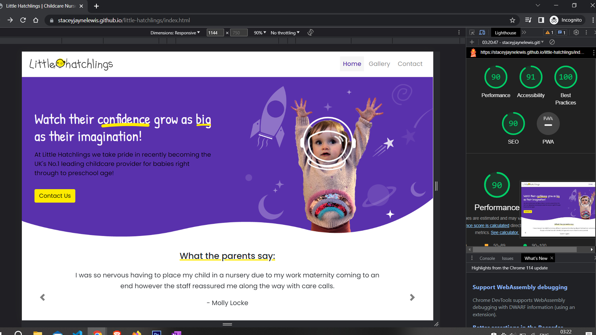
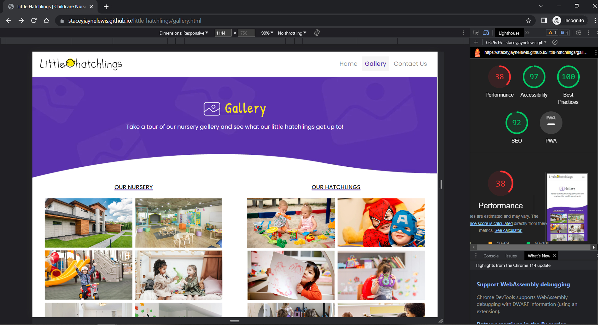
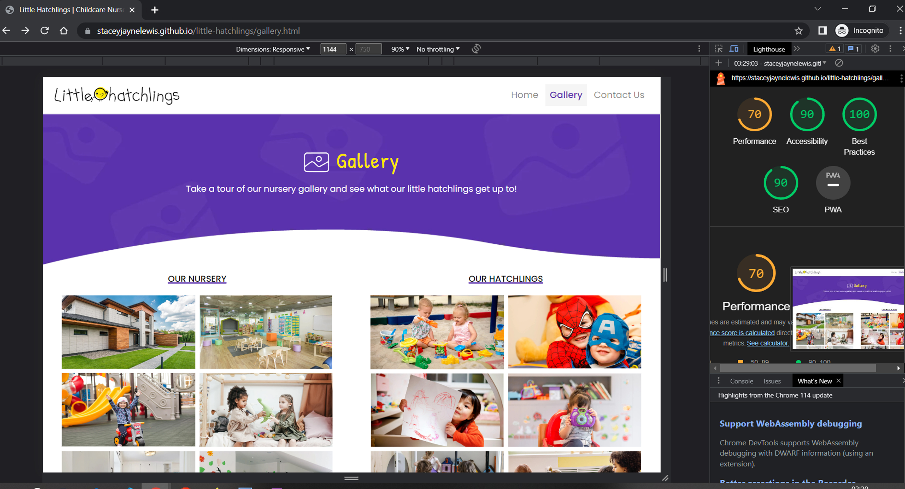
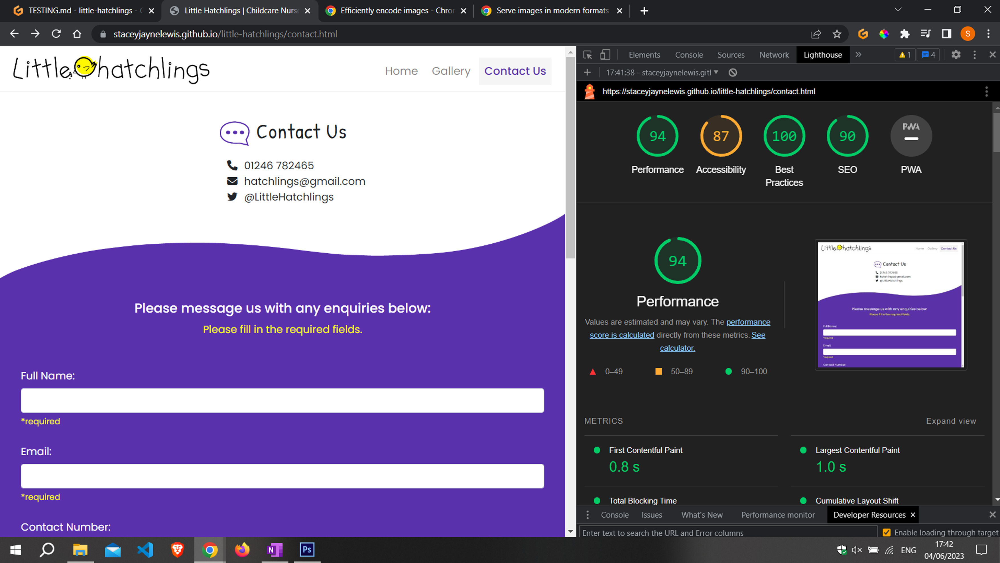
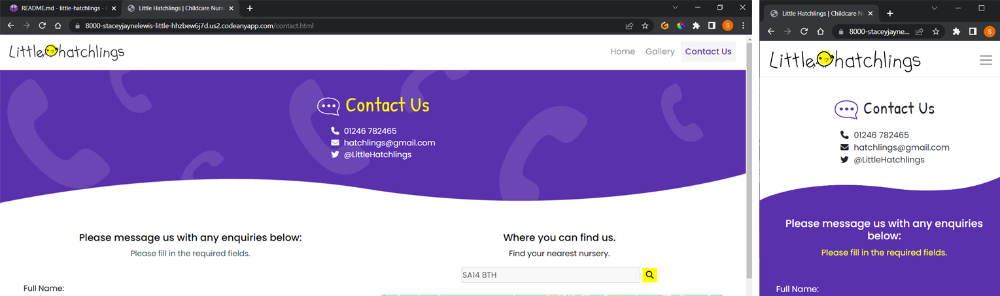
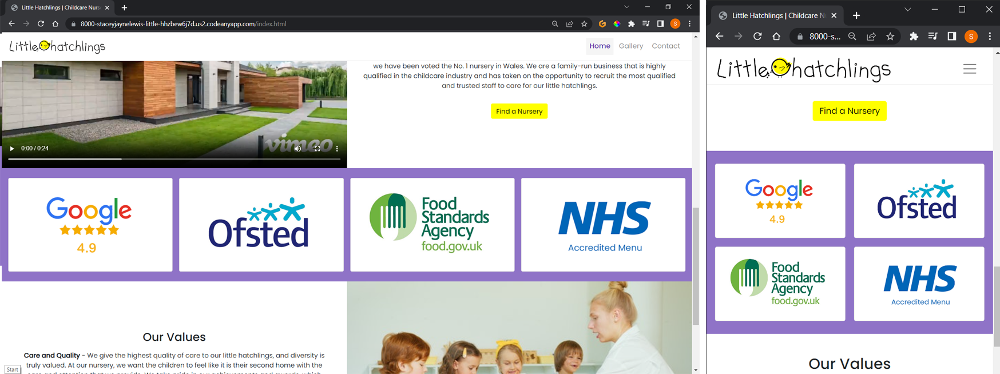
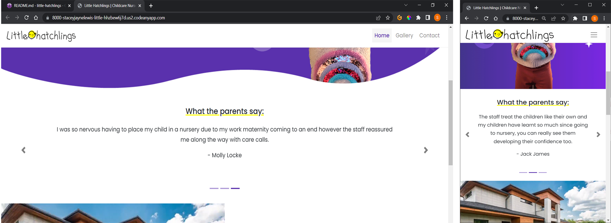
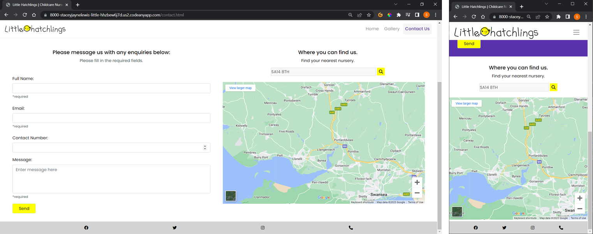
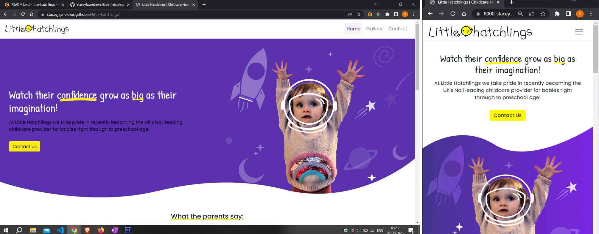

# Testing

Return back to the [README.md](README.md) file.

I have tested all of the following features on all the mobile, tablets, laptops and computers​ that I have at home but also shared my github link with friends and family so they can try it on their mobile and tablet devices, as they all have different branded devices, which are iPhones, android, and Google phones. I also tried the website on my Apple Mac laptop and Windows computer to see how they work on larger devices and on different browsers. The browsers that I tried my live website on are Google chrome, Brave and Safari. 

- The logo in the navbar is responsive across all of the above devices and the link also works to return to the homepage on each of the browsers sites too. The link also works correctly when clicked across all of the pages as it successfully directs the user to the home page (index.html) no matter which device it is tested on. The navbar collapses at the correct breakpoints for each of the devices and browsers and the dropdown works very well on the different mobile screens regardless of the brand or browser. Each navbar link works well when clicked and the response time to change to the selected page was very quick with no lagging when clicked for all devices and across all browser sites. I also tested to see if the navbar works successfully on each page and if the active key style corresponds with the correct page the user clicks on and it does work as expected again, across the same browser and devices.
- When checking the hero image and image border down the 320px responsiveness on the developer tools both elements stay within it's container and is fully responsive with each breakpoint and column change across all of the stated browsers and devices. The border and image also change at the correct breakpoint sizes for the larger device screens. You can also see using the default phone templates on the developer tools that the images and borders are hidden or shown when expected to.- For the hero header, I have again used the developer tools to check that the heading is responsive and that it does not overflow at certain breakpoint or screen sizes and it stays within the container as expected. The 'Contact Us' button on the callout heading works on all of the above-stated browsers and devices as tested by friends, family and myself. Also, the text including the header is centered on the small and medium sized screen but then aligned to the left on larger screens as it should behave on all screen sizes and browsers too. 
-  The carousel automatically slides through the testimonials and slide show buttons have proven to work across all the devices and browsers mentioned above. It also works when you swipe your finger to the left or right on touch screen devices too, such as phones and iPads. The carousel slider indicator on the bottom of the carousel also works inline with what slide they are on and whenever a slide is switched it moves to the next indicator. The indicators also work when clicked and take you to the relevant slide on all devices and browsers consistently.- For the video element and the 'About Us' section, I have tried the responsiveness and also checked that the video does not autoplay across all browsers and devices stated above. The video behaves as expected on mobile, tablet, laptop and computer and changes into 2 columns with the about section next to it as expected in the same row. The video itself plays through well on all devices and browsers from start to finish and can be paused and rewinded whenever the user wants to, according to the tests I conducted. The video does slightly lose its quality to the end of the video, but that is due to the compression to be able to upload on codeanywhere, it is not due to the browser or device. The 'Find a nursery' button in the about section button and the link attached to the button work successfully by taking the user to the contact us page when clicked, regardless of which device and browser used when tested. The about section also stays centered within the container column no matter what browser or device screen size too.
- The achievement logos/images correctly collapse when they get to the medium breakpoint into 2 rows rather than 1 inline row and maintain the responsiveness the whole way on developer tools and on the mobile templates. I have again, checked the responsiveness of these logos and the above-stated devices and browsers mentioned to make sure they are fully responsive and stay within their row. 
- The 'Our Values' section also stays centered within the container column, no matter what browser or device screen size, and the button link successfully takes the user to the gallery page as expected across all browsers & devices. The our values image is also fully responsive regardless of browser and device used and, no matter what size screen the user uses, you can still see the image as it has been styled so it focuses on the middle of the page. 
- For the gallery header, I used the developer tools, the mobile template on the developer tools and also tested on the above browsers and devices. The gallery header works successfully at adding the background when it reaches the larger screen devices and then hiding when it goes to smaller scale screen sizes. The header also sticks underneath the navbar at all times when responsively sized on different screens.
- The gallery works successfully across devices as the responsiveness works correctly by changing the column sizes when necessary when resizing the screen sizes. Each gallery image link to open each image to full size works successfully when selected, as I have tried on Windows computer, HP laptop, Samsung tablet and numerous mobile brands such as iPhones, Huawei and Google pixel. The close button on each full screen image also works successfully across all size devices and the option to even use the 'esc' option works successfully on the larger screen devices as tested on Windows and Apple laptops on chrome, safari and brave. The gallery text for the categories 'Our Hatchlings' and 'Our Nursery' keeps center aligned on top of its gallery container even when the layout changes to 1 column for the smaller devices. The 'Our Hatchlings' text is only a link on the 1 column layout for smaller devices, which is correct as the link is not needed for the larger screen devices as the layout is big enough to see both sections on one screen in 2 columns. The 'Our Hatchlings' link does work successfully by jumping to the relevant section of the page when clicked and this has, again, been tested across all of the browsers and devices stated at the beginning of this section. 
- The footer is responsive to all breakpoints and remains centered on all screen sizes and browsers that I tested and they are spaced evenly throughout the testing. Each footer icon link when clicked, just like the navbar links, the response time to change to the social media pages when the icons are clicked is very quick with no lagging when clicked and this applies to the same on each page. 
- For the contact header, I have used the developer tools, the mobile template on the developer tools and also tested on the above browsers and devices to make sure the header works successfully at adding the background when it reaches the larger screen devices and then hiding when it goes to smaller scale screen sizes. The header also sticks underneath the navbar at all times when responsively sized on different screens. 
- The contact form is responsive across all browsers and devices, which includes keeping the inputs spaced evenly apart and breaking at the large breakpoints. The send button for the form works correctly when clicked and has also been tested on different browsers and devices. This includes the form's 'required alert' notifications if the button is clicked and all required fields are not filled in or in the correct format. I have also checked to see if the message notification works after the form is submitted, which advises the user they will respond within 48hrs and the message displays appropriately for 10 seconds as requested, regardless of what device it is being submitted on. The response time to how long it takes for the notification to show after the send button is clicked is instant and this result was the same when testing all the different browsers and devices. The last thing I tested on the form is that the background color of purple is removed when it reaches the large breakpoint as it is not needed for the larger screen and this also works well on the live site on the device and browsers listed. Another test that I conducted was to make sure that the form h5 header and text stayed center aligned above the form in the column when responsive, which also was a successful result on all devices and browsers listed above.
- The map feature is responsive to the screen size and, just like the form, at the large breakpoint changes into a 2 column row, successfully causing the map to be alongside the form. Having tested this on a windows computer, Apple mac and HP laptop, it is clear that this has worked successfully on their default browsers and the additional browsers listed such as brave.The input and search button for the map stay inline next to eachothrer regardless of size screen and browser whilst staying center aligned in the container and this also applies to the map heading and text.

## Code Validation

### HTML

I have used the recommended [HTML W3C Validator](https://validator.w3.org) to validate all of my HTML files.

| Page | W3C URL | Screenshot | Notes |
| --- | --- | --- | --- |
| Home | [W3C](https://validator.w3.org/nu/?doc=https%3A%2F%2Fstaceyjaynelewis.github.io%2Flittle-hatchlings%2Findex.html) |  | Section lacks header h2-h6 warning, Bad value 100% for attribute width on element video & No p element in scope but a p end tag seen - FIXED CORRECTIONS |
| Gallery | [W3C](https://validator.w3.org/nu/?doc=https%3A%2F%2Fstaceyjaynelewis.github.io%2Flittle-hatchlings%2Fgallery.html) |  | Section lacks header h2-h6 warning & Stray end tag a - FIXED CORRECTIONS |
| Contact | [W3C](https://validator.w3.org/nu/?doc=https%3A%2F%2Fstaceyjaynelewis.github.io%2Flittle-hatchlings%2Fcontact.html) |  | No errors or warnings to show. |

### CSS

I have used the recommended [CSS Jigsaw Validator](https://jigsaw.w3.org/css-validator) to validate all of my CSS files.

| File | Jigsaw URL | Screenshot | Notes |
| --- | --- | --- | --- |
| style.css | [Jigsaw](https://jigsaw.w3.org/css-validator/validator?uri=https%3A%2F%2FstaceyJayneLewis.github.io%2Flittle-hatchlings) |  | 2 value errors - FIXED CORRECTIONS |

## Browser Compatibility

I've tested my deployed project on multiple browsers to check for compatibility issues.

| Browser | Screenshot | Notes |
| --- | --- | --- |
| Chrome |  | Works as expected |
| Edge |  | Works as expected |
| Brave |  | Works as expected |
| Firefox |  | Works as expected |

## Responsiveness

I've tested my deployed project on multiple devices to check for responsiveness issues.

| Device | Screenshot | Notes |
| --- | --- | --- |
| Google Pixel 7 |  | Works as expected |
| iPhone 14 |  | Works as expected |
| Mobile Samsung S8+ (DevTools) |  | Works as expected |
| Mobile iPhone 12 Pro (DevTools) |  | Works as expected |
| iPad (DevTools) |  | Works as expected |
| Samsung tablet |  | Works as expected |
| Laptop |  | Works as expected |
| Desktop | 

## Lighthouse Audit

I've tested my deployed project using the Lighthouse Audit tool to check for any major issues.

| Page | Size | Screenshot | Notes |
| --- | --- | --- | --- |
| Home | Mobile |  | Few warnings |
| Home | Desktop |  | Some minor warnings |
| Gallery | Mobile |  | Few warnings |
| Gallery | Desktop |  | Some minor warnings |
| Contact | Mobile |  | | Some minor warnings
| Contact | Desktop |  | good performance |

## User Story Testing

| New User Story | Screenshot |
| --- | --- |
| As a new site user, I would like to find contact information easily so that I can simply contact the nursery with any queries. |   |
| As a new site user, I would like to see a simple gallery, so that I can get an idea of what the nursery looks like and the rooms/facilities they have. |  |
| As a new site user, I would like to see reviews and awards the nursery have achieved, so that I can be reassured that my child will be safe and looked after well. |    |
| As a new site user, I would like to see a video that will show quick clips of the typical day at the nursery so that I can visualise what my child will be getting involved in. |  |
| As a new site user, I would like to see a map where I can easily locate the nursery with their address or be able to search for the nearest center to my location. |  |

| Returning User Story | Screenshot |
| --- | --- |
| As a returning site user, I would like to check if there are nursery centres near me if I move/plan to move home, so that I can change the location of the nursery to a closer one. |  |
| As a returning site user, I would like to have easy access to social media links, so that I can share any feedback or share the nursery images that has my child in. |  |
| As a returning site user, I would like to have a mobile friendly design so that I can visit the website on my mobile or tablet aswell as desktop |  |

## Bugs

- JS Uncaught ReferenceError: `foobar` is undefined/not defined

    

    - To fix this, I _____________________.

- JS `'let'` or `'const'` or `'template literal syntax'` or `'arrow function syntax (=>)'` is available in ES6 (use `'esversion: 11'`) or Mozilla JS extensions (use moz).

    

    - To fix this, I _____________________.

- Python `'ModuleNotFoundError'` when trying to import module from imported package

    

    - To fix this, I _____________________.

- Django `TemplateDoesNotExist` at /appname/path appname/template_name.html

    

    - To fix this, I _____________________.

- Python `E501 line too long` (93 > 79 characters)

    

    - To fix this, I _____________________.

### GitHub **Issues**

⚠️⚠️⚠️⚠️⚠️ START OF NOTES (to be deleted) ⚠️⚠️⚠️⚠️⚠️

An improved way to manage bugs is to use the built-in **Issues** tracker on your GitHub repository.
To access your Issues, click on the "Issues" tab at the top of your repository.
Alternatively, use this link: https://github.com/staceyJayneLewis/little-hatchlings/issues

If using the Issues tracker for your bug management, you can simplify the documentation process.
Issues allow you to directly paste screenshots into the issue without having to first save the screenshot locally,
then uploading into your project.

You can add labels to your issues (`bug`), assign yourself as the owner, and add comments/updates as you progress with fixing the issue(s).

Once you've sorted the issue, you should then "Close" it.

When showcasing your bug tracking for assessment, you can use the following format:

🛑🛑🛑🛑🛑 END OF NOTES (to be deleted) 🛑🛑🛑🛑🛑

**Fixed Bugs**

All previously closed/fixed bugs can be tracked [here](https://github.com/staceyJayneLewis/little-hatchlings/issues?q=is%3Aissue+is%3Aclosed).

| Bug | Status |
| --- | --- |
| [JS Uncaught ReferenceError: `foobar` is undefined/not defined](https://github.com/staceyJayneLewis/little-hatchlings/issues/1) | Closed |
| [Python `'ModuleNotFoundError'` when trying to import module from imported package](https://github.com/staceyJayneLewis/little-hatchlings/issues/2) | Closed |
| [Django `TemplateDoesNotExist` at /appname/path appname/template_name.html](https://github.com/staceyJayneLewis/little-hatchlings/issues/3) | Closed |

**Open Issues**

Any remaining open issues can be tracked [here](https://github.com/staceyJayneLewis/little-hatchlings/issues).

| Bug | Status |
| --- | --- |
| [JS `'let'` or `'const'` or `'template literal syntax'` or `'arrow function syntax (=>)'` is available in ES6 (use `'esversion: 11'`) or Mozilla JS extensions (use moz).](https://github.com/staceyJayneLewis/little-hatchlings/issues/4) | Open |
| [Python `E501 line too long` (93 > 79 characters)](https://github.com/staceyJayneLewis/little-hatchlings/issues/5) | Open |

## Unfixed Bugs

⚠️⚠️⚠️⚠️⚠️ START OF NOTES (to be deleted) ⚠️⚠️⚠️⚠️⚠️

You will need to mention unfixed bugs and why they were not fixed.
This section should include shortcomings of the frameworks or technologies used.
Although time can be a big variable to consider, paucity of time and difficulty understanding
implementation is not a valid reason to leave bugs unfixed.

If you've identified any unfixed bugs, no matter how small, be sure to list them here.
It's better to be honest and list them, because if it's not documented and an assessor finds the issue,
they need to know whether or not you're aware of them as well, and why you've not corrected/fixed them.

Some examples:

🛑🛑🛑🛑🛑 END OF NOTES (to be deleted) 🛑🛑🛑🛑🛑

- On devices smaller than 375px, the page starts to have `overflow-x` scrolling.

    

    - Attempted fix: I tried to add additional media queries to handle this, but things started becoming too small to read.

- For PP3, when using a helper `clear()` function, any text above the height of the terminal does not clear, and remains when you scroll up.

    

    - Attempted fix: I tried to adjust the terminal size, but it only resizes the actual terminal, not the allowable area for text.

- When validating HTML with a semantic `section` element, the validator warns about lacking a header `h2-h6`. This is acceptable.

    

    - Attempted fix: this is a known warning and acceptable, and my section doesn't require a header since it's dynamically added via JS.

<!-- If you legitimately cannot find any unfixed bugs or warnings, then use the following sentence:

There are no remaining bugs that I am aware of. -->
